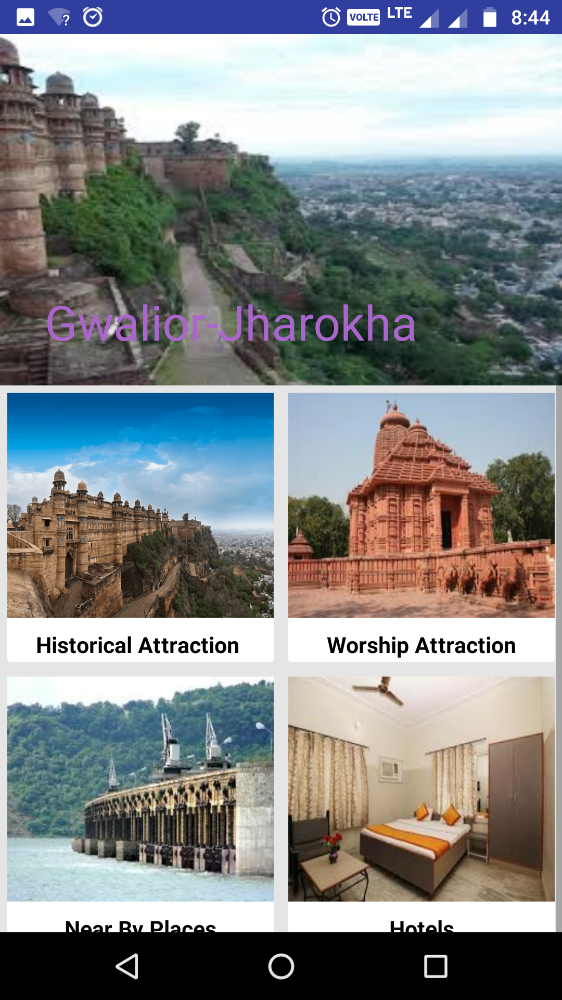

# Jharokha-E-Gwalior
Zaika-E-Gwalior is an android application providing the detailed information about the best old and known delicacies of Gwalior that defines the city.Apart from the restaurants and Hotels 
these rich old places are the food joints and of cultural importance that defines the taste of the city as a blend ofMaratha, Mughal and North Indian Food Culture.Initial version 1 is launched and this version only gives 
information about the Food Places.In near future the next version aims to bring the all segments as Heritage,Worship Sites,Musical Gharana and Events of City.
Mentor- Dr. Anurag Shrivastava
Developers- Akash Soni ,Rohit Kumar Prajapati,Mona Singh - IPG 4th year

 
 
 
 
 

